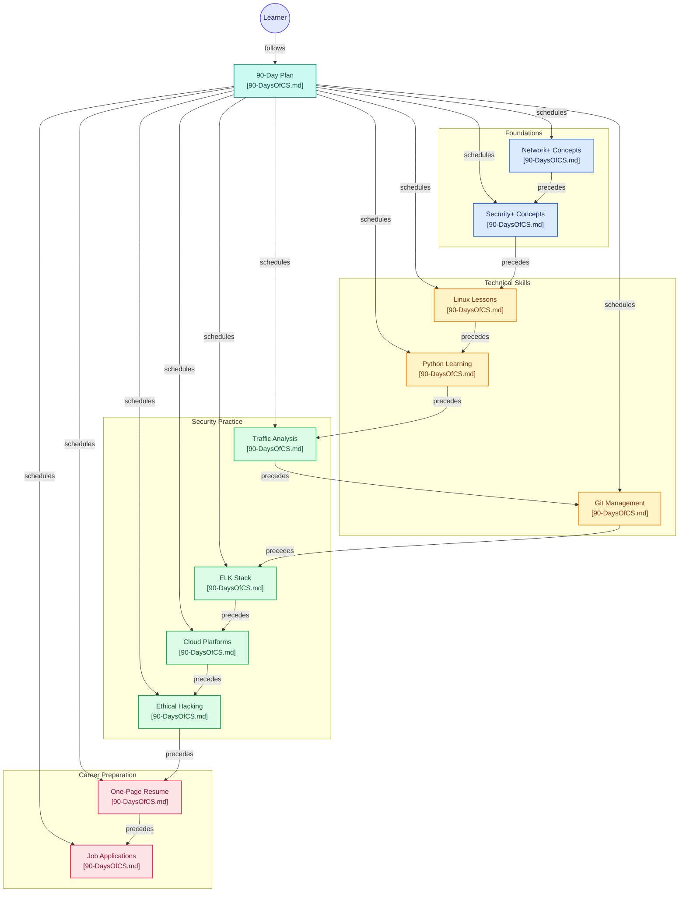

```mermaid
flowchart TD

subgraph group_foundations["Foundations"]
  node_network["Network+ Concepts<br/>[90-DaysOfCS.md]"]
  node_security["Security+ Concepts<br/>[90-DaysOfCS.md]"]
end

subgraph group_technical["Technical Skills"]
  node_linux["Linux Lessons<br/>[90-DaysOfCS.md]"]
  node_python["Python Learning<br/>[90-DaysOfCS.md]"]
  node_git["Git Management<br/>[90-DaysOfCS.md]"]
end

subgraph group_security_practice["Security Practice"]
  node_traffic["Traffic Analysis<br/>[90-DaysOfCS.md]"]
  node_elk["ELK Stack<br/>[90-DaysOfCS.md]"]
  node_cloud["Cloud Platforms<br/>[90-DaysOfCS.md]"]
  node_ethical_hacking["Ethical Hacking<br/>[90-DaysOfCS.md]"]
end

subgraph group_career["Career Preparation"]
  node_resume["One-Page Resume<br/>[90-DaysOfCS.md]"]
  node_applications["Job Applications<br/>[90-DaysOfCS.md]"]
end

node_learner(("Learner"))
node_plan["90-Day Plan<br/>[90-DaysOfCS.md]"]

node_learner -->|"follows"| node_plan
node_plan -->|"schedules"| node_network
node_plan -->|"schedules"| node_security
node_plan -->|"schedules"| node_linux
node_plan -->|"schedules"| node_python
node_plan -->|"schedules"| node_traffic
node_plan -->|"schedules"| node_git
node_plan -->|"schedules"| node_elk
node_plan -->|"schedules"| node_cloud
node_plan -->|"schedules"| node_ethical_hacking
node_plan -->|"schedules"| node_resume
node_plan -->|"schedules"| node_applications
node_network -->|"precedes"| node_security
node_security -->|"precedes"| node_linux
node_linux -->|"precedes"| node_python
node_python -->|"precedes"| node_traffic
node_traffic -->|"precedes"| node_git
node_git -->|"precedes"| node_elk
node_elk -->|"precedes"| node_cloud
node_cloud -->|"precedes"| node_ethical_hacking
node_ethical_hacking -->|"precedes"| node_resume
node_resume -->|"precedes"| node_applications

click node_plan "https://github.com/said-mammadov/infosec/blob/main/90-DaysOfCS.md"
click node_network "https://github.com/said-mammadov/infosec/blob/main/90-DaysOfCS.md"
click node_security "https://github.com/said-mammadov/infosec/blob/main/90-DaysOfCS.md"
click node_linux "https://github.com/said-mammadov/infosec/blob/main/90-DaysOfCS.md"
click node_python "https://github.com/said-mammadov/infosec/blob/main/90-DaysOfCS.md"
click node_traffic "https://github.com/said-mammadov/infosec/blob/main/90-DaysOfCS.md"
click node_git "https://github.com/said-mammadov/infosec/blob/main/90-DaysOfCS.md"
click node_elk "https://github.com/said-mammadov/infosec/blob/main/90-DaysOfCS.md"
click node_cloud "https://github.com/said-mammadov/infosec/blob/main/90-DaysOfCS.md"
click node_ethical_hacking "https://github.com/said-mammadov/infosec/blob/main/90-DaysOfCS.md"
click node_resume "https://github.com/said-mammadov/infosec/blob/main/90-DaysOfCS.md"
click node_applications "https://github.com/said-mammadov/infosec/blob/main/90-DaysOfCS.md"

classDef toneNeutral fill:#f8fafc,stroke:#334155,stroke-width:1.5px,color:#0f172a
classDef toneBlue fill:#dbeafe,stroke:#2563eb,stroke-width:1.5px,color:#172554
classDef toneAmber fill:#fef3c7,stroke:#d97706,stroke-width:1.5px,color:#78350f
classDef toneMint fill:#dcfce7,stroke:#16a34a,stroke-width:1.5px,color:#14532d
classDef toneRose fill:#ffe4e6,stroke:#e11d48,stroke-width:1.5px,color:#881337
classDef toneIndigo fill:#e0e7ff,stroke:#4f46e5,stroke-width:1.5px,color:#312e81
classDef toneTeal fill:#ccfbf1,stroke:#0f766e,stroke-width:1.5px,color:#134e4a
class node_network,node_security toneBlue
class node_linux,node_python,node_git toneAmber
class node_traffic,node_elk,node_cloud,node_ethical_hacking toneMint
class node_resume,node_applications toneRose
class node_learner toneIndigo
class node_plan toneTeal
```
